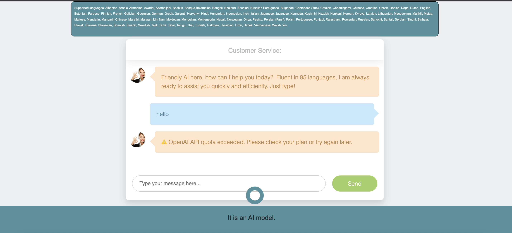

# Flask-OpenAI-Chatbot

A Flask chatbot application that is powered by OpenAI's GPT-3.5 Turbo. It features a user-friendly chatbot UI written in HTML.

## Features

- Utilize OpenAI's GPT-3.5 Turbo for intelligent responses.
- User-friendly chatbot interface built with HTML and Flask.

### Prerequisites

- Python 3.7+ installed on your system.
- Flask 2.0.1 and OpenAI Python SDK installed.
- Set up your OpenAI API key.

